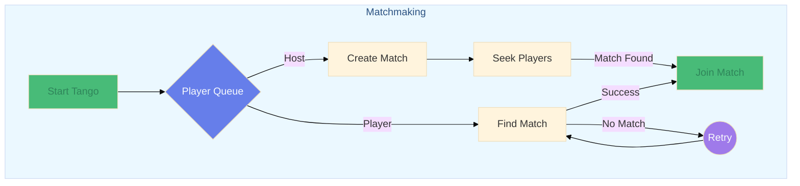
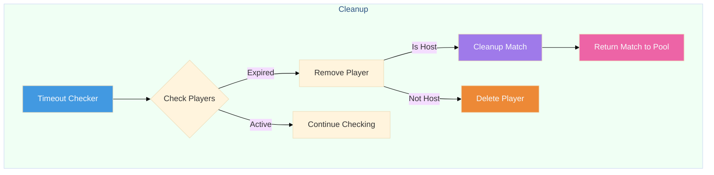

# Tango
[](https://codecov.io/gh/alesr/tango)

Tango is experimental matchmaking service written in Go that I built for fun. It handles player queues and match creation with a focus on concurrent operations.

## ⚠️ Heads Up

This is an **experimental** project. I built it to explore some ideas around matchmaking and concurrent patterns in Go. While it works, I wouldn't recommend using it in production just yet. Feel free to poke around and maybe grab some ideas for your own projects.

## How Tango Works

### Flow Overview

When you start Tango, it spins up two main background processes:
1. An operation processor that handles new players/hosts and other match-related operations
2. A timeout checker that removes players with expired matching timeouts

```
                               ┌── Host → Creates new match
Player Enqueue → Operation ────┤
                               └── Player → Attempts to join existing match
```

Players can be either hosts (create matches) or joiners (look for matches). When a host joins:

- A match is created immediately
- Tango starts actively looking for suitable players to join this match

When a regular player joins, Tango keeps trying to find a suitable match until either:

- A match is found
- The player times out
- The context is cancelled

#### Matchmaking Flow



#### Cleanup Flow



### Setup and Lifecycle

```go
import "github.com/alesr/tango"

// Create a new Tango instance
tango := tango.New(
    tango.WithOperationBufferSize(100),
    tango.WithDefaultTimeout(5*time.Second),
    // More options available...
)

// Start the service
err := tango.Start()

// Shut it down!
err := tango.Shutdown(ctx)
```

### Player Management

```go
// Create a new player
player := tango.NewPlayer(
    "player-1",     // ID
    false,          // IsHost
    tango.Mode1v1,  // Game mode
    deadline,       // Timeout (how long it should look for a match)
    []string{"tag"} // Optional tags (not in use yet)
)

// Add to matchmaking queue
err := tango.Enqueue(ctx, player)

// Remove from system
err := tango.RemovePlayer("player-1")
```

### Match Operations

```go
// Get all active matches
matches := tango.ListMatches()
```

### Configuration Options

    - WithLogger: Custom logger for the service
    - WithOperationBufferSize: Size of the operation channel buffer
    - WithMatchBufferSize: Size of the match channel buffer
    - WithAttemptToJoinFrequency: How often to try matching players
    - WithCheckDeadlinesFrequency: How often to check for timeouts
    - WithDefaultTimeout: Default operation timeout

### Game Modes

- `GameMode1v1`: 1 host + 1 player
- `GameMode2v2`: 1 host + 3 players
- `GameMode3v3`: 1 host + 5 players

## Future Improvements

Some cool ideas I'd like to explore:

- Use tags for smarter matching (skill levels, regions, etc.)
- Add match status notifications (websockets maybe?)
- Match lifetime management (auto-cleanup after game ends)
- Match history tracking
- Support for tournament-style matchmaking
- Custom matching rules
- Support for teams

Got more ideas? I'd love to hear them!

## Performance

I've included some benchmarks for exploration, but given the concurrent nature of the system, take the numbers with a grain of salt. If you're curious:

```bash
make bench      # Run benchmarks
make pprof-cpu  # CPU profile analysis
make pprof-mem  # Memory profile analysis
```
