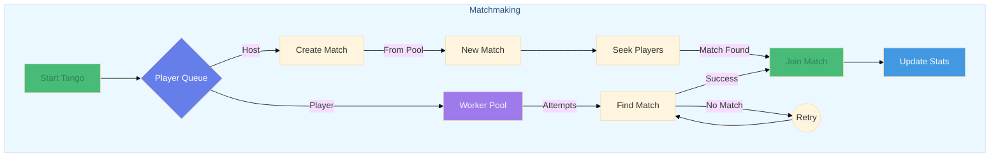
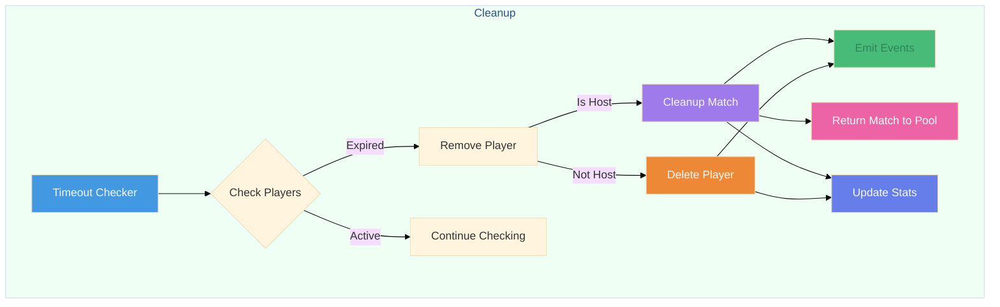

# Tango

[](https://codecov.io/gh/alesr/tango)

## ⚠️ Heads Up

This is an **experimental** project. I built it to explore some ideas around matchmaking and concurrent patterns in Go. While it works, I wouldn't recommend using it in production *just yet*. Feel free to poke around and maybe grab some ideas for your own projects.

## How Tango Works

### Flow Overview

When you start Tango, it spins up three main background processes:

1. An operation processor that handles new players/hosts and other match-related operations
2. A timeout checker that removes players with expired matching timeouts
3. A stats updater that periodically collects matchup statistics

> **Note**: The diagrams below only show the operation processor and timeout checker for simplicity.

```bash
                               ┌── Host → Creates new match
Player Enqueue → Operation ────┤
                               └── Player → Attempts to join existing match
```

Players can be either hosts (create matches) or joiners (look for matches). When a host joins:

- A match is created immediately
- Tango starts actively looking for suitable players to join this match

When a regular player joins, Tango keeps trying to find a suitable match until either:

- A match is found
- The player times out
- The context is cancelled

#### Matchmaking Flow



#### Cleanup Flow



### Setup and Lifecycle

```go
import "github.com/alesr/tango"

// Create a new Tango instance
tango := tango.New(
    tango.WithOperationBufferSize(100),
    tango.WithDefaultTimeout(5*time.Second),
    // More options available...
)

// Start the service
err := tango.Start()

// Shut it down!
err := tango.Shutdown(ctx)
```

### Player Management

```go
// Create a new player
player := tango.NewPlayer(
    "player-1",     // ID
    false,          // IsHost
    tango.Mode1v1,  // Game mode
    deadline,       // Timeout (how long it should look for a match)
    []string{"tag"} // Optional tags (not in use yet)
)

// Add to matchmaking queue
err := tango.Enqueue(ctx, player)

// Remove from system
err := tango.RemovePlayer("player-1")
```

### Match Operations

```go
// Get all active matches
matches := tango.ListMatches()
```

### Stats

You can call the Stats() method at any time to retrieve match statistics:

```go
stats, _ := tango.Stats(ctx)

fmt.Printf("Total Players: %d\n", stats.TotalPlayers)
fmt.Printf("Total Matches: %d\n", stats.TotalMatches)
```

### Configuration Options

- WithLogger: Custom logger for the service
- WithOperationBufferSize: Size of the operation channel buffer
- WithMatchBufferSize: Size of the match channel buffer
- WithAttemptToJoinFrequency: How often to try matching players
- WithCheckDeadlinesFrequency: How often to check for timeouts
- WithDefaultTimeout: Default operation timeout

### Game Modes

- `GameMode1v1`: 1 host + 1 player
- `GameMode2v2`: 1 host + 3 players
- `GameMode3v3`: 1 host + 5 players

## Future Improvements

Some cool ideas I'd like to explore:

- Use tags for smarter matching (skill levels, regions, etc.)
- Add match status notifications (websockets maybe?)
- Match lifetime management (auto-cleanup after game ends)
- Match history tracking
- Support for tournament-style matchmaking
- Custom matching rules
- Support for teams

Got more ideas? I'd love to hear them!

## Load Testing

To make sure Tango works well under different conditions, i've set up some load tests. These tests are there to simulate various scenarios and see how the system handles them.

### Running Load Tests

You can run the load tests using this command:

```bash
make test-load
```

This will execute all the test cases in the `loadtest` package.

### Configuring Load Tests

The load testing framework is flexible. You can adjust various parameters like the number of requests, concurrency level, duration, and more through a configuration struct:

```go
type Config struct {
    Requests           int
    ConcurrentRequests int
    Duration           time.Duration
    StatsInterval      time.Duration
    RequestsPerSecond  float64
    Scenario           string
}
```

### Example Scenarios

I have a few predefined scenarios to simulate different types of workloads:

- **High Concurrency**: Simulates many concurrent requests with a specified rate limit.
- **Host Heavy**: Focuses on creating matches where most players are hosts.
